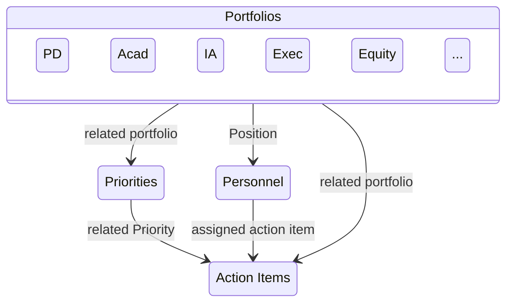

# Introduction

All data regarding the ongoing management of The Association will be stored on
a Notion. The upkeep of this system shall be the duty of the Internal Affairs
Portfolio.  This system shall be made up of multiple databases storing:

- Action Items — actions that must be done
- Personnel — who does what
- Priorities — what actions must be done *for*
- Portfolios — what priorities hope to *accomplish*

These databases will be related to each other like below.

Each portfolio will then have all related Action Items rendered on their
respective portfolio in order to be up-to-date on what is happening within each
ministry. Furthermore, All Hands functions are displayed for the entire
Association to see. All information will be available to all working members
unless there is a conflict of interest.

Note: Nodes are databases and edges are relations.

\pagebreak

# Portfolios

The most important part of this system are the Portfolios. They contain the
overarching goals of The Association and allows for cohesive and effective work
to be done. Portfolios must be named for a field of interest The Association
wishes to implement or evolve. 

# Priorities

The actions that will be taken to fulfill a Portfolio manifest in Priorities,
which are the *specific* large goals The Association wishes to achieve. The
culmination of these goals are the plans The Association has for each semester.
Priorities can be related to one or many Portfolios.

# Action Items

Action Items are the atomic, *most specific* tasks that eventually build up to
*none* or more Priorities. While these tasks, meeting, events, etc. do not
necessarily need to be related to a priority — they are always related to at
least one portfolio. 

# Alterations

However, if Action Items later on in time can be seen to culminate to an
undeclared Priority, a new Priority should be made to track any progress. The
same rule applies for Portfolios → Priorities; meaning if at one point
Priorities can be seen to apply to a different or new Portfolios — action
should be taken to reflect that.

Priorities should be assessed and evaluated at the beginning of each Semester.
This is a dedicated time for the leadership team to create new
Priorities/Portfolios and asses the performance of existing ones. Additionally,
the Personnel in each portfolio will meet and do the same with their Action
Items.

# Summary

This system should thus allow for an *open playing field* where all working
members of The Association will be able to view what is going on with their
peers and allow for a more cohesive working environment. This is a architecture
known as **Management by Objectives** which requires the full support of the
Executive to operate effectively.
