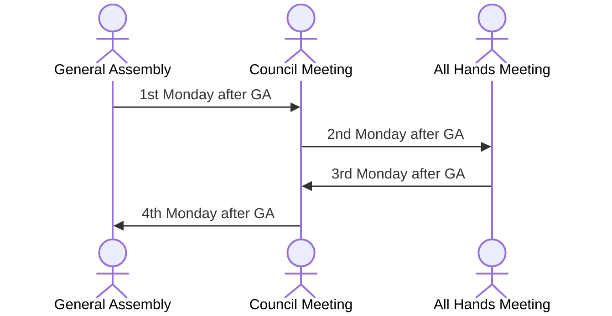

# Meetings

Meetings are critical to ensuring there is strong communication within
COMPSA; making sure everyone is on the same page.

Internal Affairs is responsible for scheduling and managing all COMPSA-wide
meetings.

There are three recurring compsa-wide meetings that happen throughout the year:

| Meeting           | interval      |
|-------------------|---------------|
| General Assembly  | every 3 weeks |
| Council Meeting   | biweekly      |
| All Hands Meeting | biweekly      |

One of these meetings happens Each week. General Assemblies & All Hands
Meetings happen every 4 weeks; Council Meetings happen every 2 weeks. 

## Schedule

These meetings are scheduled on a four week interval, each happening
consecutively and on the the same day of the week

| Week | Meeting           |
|------|-------------------|
| 0    | General Assembly  |
| 1    | Council Meeting   |
| 2    | All Hands Meeting |
| 3    | Council Meeting   |

\pagebreak

Consider the sequence diagram (because compsci) illustrating the meeting
schedule interval:



Note: In the past, Monday; 5-6, in Walter Light 210 and the COMPSA Office has
worked well.

## General Assemblies

> General Assemblies are a time for all members of COMPSA (students in the
> school of Computing) can come and voice ther concerns about the current affairs
> of Computing Students.

General Assemblies (GAs) are held in a large classroom or auditorium, typically
in Goodwin or Walter-Light Halls.
During the GA, the speaker conducts the meeting following Burnoits Rules of
order (however, strictly following them is not necessary)

## Council Meetings

> Council Meetings are a time for Ministers and the Executive to update
> eachother on what they have been working on, and to plan & collaborate on future
> tasks

These meetings are normally held in the COMPSA Office. The start of the meeting
should consist of everyone giving updates on what they have done and what they
plan to do for the upcoming weeks. After this is done, executives should go into
groups with their portfolios to discuss things in a more dynamic way --
allowing ministers to collaborate with other directors.

## All Hands Meetings

> All Hands Meetings are a time for all members of COMPSA to mingle (attendance
> is mandatory) and for the Executive and Council to update working members of the
> goings-on at COMPSA.

The meeting should begin with _brief_ updates from the Exec and Council, and
should be followed by a small social for volunteer appreciation. 

While Governance & Culture handles organizing the meeting, it is traditional for the Exec to
manage the volunteer appreciation afterwards.

# Newsletters

Newsletter are maintained by COMPSA in order to ensure that everyone inside and
out of The Association can be informed about what work has been done.

IA is responsible for collecting information needed to then also create and
distribute both an **Internal & Student** newsletter.

## Schedule 

The newsletters are released on a schedule such that:

| Type      | Frequency     | Day    | starts on                  |
|-----------|---------------|--------|----------------------------|
| Print     | Biweekly      | Friday | Friday before the first GA |
| Email     | Every 3 Weeks | Monday | Monday of the first GA     |

# Process

## 1. Internal Newsletter
1. Collect info from Directors & Presidents about what is coming up / going
   on for each portfolio in the week before the newsletter is due
2. Write it all down nicely in a markdown file in this repo
3. Send it in a Discord server announcement, starting the firday before the
   first


## 2. Maintain Monthly Student Newsletter
1. Summarize the last 2 Internal Newsletters to include only things
   important to students, making it quick and easy to read
2. Also summarize the most recent GA's minutes to give updates and bring
   awareness to the GA
3. Write the final draft up in `$EMAIL_LIST_SENDING_SOFTWARE` and send to
   `$COMPUTING_STUDENT_EMAIL_LIST`, starting on the day of the first
   GA (afterwards, in order to allow the minutes to be added)

# Collecting Information

The Scribe & Policy Officer are responsible for collecting all of the
information for the newsletter. Information must be collected from:

```
PRES - The President
VPOP - VP Operations
VPSA - VP Student Affairs

GOVC - Governance & Culture
FINC - Finance
TECH - Tech

MKTG - Marketing
EVTS - Events
SOCS - Socials

ACAD - Academics
EQTY - Equity
PDEV - Professional Development
```

## Info Collection Template

This markdown should be used as a message template when contacting people about
updates for the newsletter

```markdown
### Newsletter Updates :)

Hi [$DIRECTOR | $EXEC] ! We (the scribes @ IA) were wondering if you had any
info to add to the upcoming internal newsletter. For some inspiration, it could
include:

- Cool accomplishments
- Exciting plans
- Anything else you'd like tell people about!

If there's anything you'd like to add, just make sure u reply by this coming
friday :))
```

# Distrubution

- The internal newsletter is sent via. discord, normally in an announcement
- The Student newsletter is distrubuted using:
  > Not sure yet, but I think it might be possible to use GSuite

- The mailing list for all the students in the School of Computing can be
  procured from the SoC administration (ie. Karen Knight)
