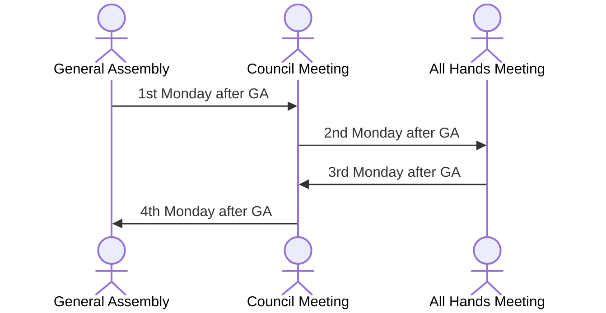

# Meetings

Meetings are critical to ensuring there is strong communication within
COMPSA; making sure everyone is on the same page.

Governance & Culture is responsible for scheduling and managing all COMPSA-wide
meetings.

There are three recurring compsa-wide meetings that happen throughout the year:

| interval      | Meeting           |
|---------------|-------------------|
| every 3 weeks | General Assembly  |
| biweekly      | Council Meeting   |
| biweekly      | All Hands Meeting |

[//]: # ([`Meetings::Types = {GA, Council, AllHands}`])

One of these meetings happens Each week. General Assemblies & All Hands
Meetings happen every 4 weeks; Council Meetings happen every 2 weeks. 

## Schedule

These meetings are scheduled on a four week interval, each happening
consecutively and on the the same day of the week

| Week | Meeting           |
|------|-------------------|
| 0    | General Assembly  |
| 1    | Council Meeting   |
| 2    | All Hands Meeting |
| 3    | Council Meeting   |

\pagebreak

Consider the sequence diagram (because compsci) illustrating the meeting
schedule interval:

Note: In the past, Monday; 5-6, in Walter Light 210 and the COMPSA Office has
worked well.

## General Assemblies

> General Assemblies are a time for all members of COMPSA (students in the
> school of Computing) can come and voice ther concerns about the current affairs
> of Computing Students.

General Assemblies (GAs) are held in a large classroom or auditorium, typically
in Goodwin or Walter-Light Halls.
During the GA, the speaker conducts the meeting following Burnoits Rules of
order (however, strictly following them is not necessary)

## Council Meetings

> Council Meetings are a time for Ministers and the Executive to update
> eachother on what they have been working on, and to plan & collaborate on future
> tasks

These meetings are normally held in the COMPSA Office. The start of the meeting
should consist of everyone giving updates on what they have done and what they
plan to do for the upcoming weeks. After this is done, executives should go into
groups with their portfolios to discuss things in a more dynamic way --
allowing ministers to collaborate with other directors.

## All Hands Meetings

> All Hands Meetings are a time for all members of COMPSA to mingle (attendance
> is mandatory) and for the Executive and Council to update working members of the
> goings-on at COMPSA.

The meeting should begin with _brief_ updates from the Exec and Council, and
should be followed by a small social for volunteer appreciation. 

While Governance & Culture handles organizing the meeting, it is traditional for the Exec to
manage the volunteer appreciation afterwards.
