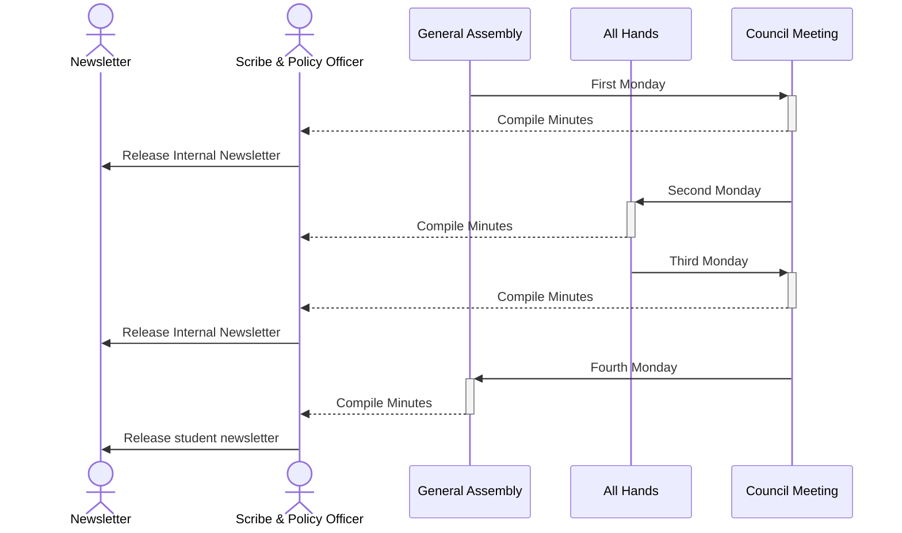

# Newsletters

Newsletter are maintained by COMPSA in order to ensure that everyone inside and
out of The Association can be informed about what work has been done.

Governanve & Culture (G&C) is responsible for collecting information needed to
then also create and distribute both an **Internal & Student** newsletter.

# Scheduling

The Internal and Student newsletters are released as follows:

| Newsletter | Frequency     | Starts on                             | 
|------------|---------------|---------------------------------------| 
| Internal   | biweekly      | The Friday before the first All Hands | 
| Student    | every 3 weeks | The Monday of the first GA            |

Consider this sequence diagram which includes
the [Meeting Schedule](meetings-manual.md#schedule) along with the newsletter
release schedule:



# Process

## Internal Newsletter
1. Collect info from Directors & Presidents about what is coming up / going
   on for each portfolio in the week before the newsletter is due
2. Write it all down nicely in a markdown file in this repo
3. Send it in a Discord server announcement, starting the firday before the
   first


## Student Newsletter
1. Summarize the last 2 Internal Newsletters to include only things
   important to students, making it quick and easy to read
2. Also summarize the most recent GA's minutes to give updates and bring
   awareness to the GA
3. Write the final draft up in `$EMAIL_LIST_SENDING_SOFTWARE` and send to
   `$COMPUTING_STUDENT_EMAIL_LIST`, starting on the day of the first
   GA (afterwards, in order to allow the minutes to be added)

# Collecting Information

The Scribe & Policy Officer are responsible for collecting all of the
information for the newsletter. Information must be collected from:

```
PRES - The President
VPOP - VP Operations
VPSA - VP Student Affairs

GOVC - Governance & Culture
FINC - Finance
TECH - Tech

MKTG - Marketing
EVTS - Events
SOCS - Socials

ACAD - Academics
EQTY - Equity
PDEV - Professional Development
```

## Info Collection Template

This markdown can be used as a message template when contacting people about
updates for the newsletter -- however its always best to ask more personalized
questions based on any info you gathered beforehand (like from a prior meeting,
where you just need more details for it)

```markdown
### Newsletter Updates :)

Hi [$DIRECTOR | $EXEC] ! We (the scribes @ IA) were wondering if you had any
info to add to the upcoming internal newsletter. For some inspiration, it could
include:

- Cool accomplishments
- Exciting plans
- Anything else you'd like tell people about!

If there's anything you'd like to add, just make sure u reply by this coming
friday :))
```

# Distribution


- The internal newsletter 
  is **sent via. discord**, normally in an announcement

- The Student newsletter is distributed using:
   Not sure yet, but I think it might be possible to use GSuite.

  The mailing list for all the students in the School of Computing can be
  procured from the SoC administration (ie. Karen Knight)