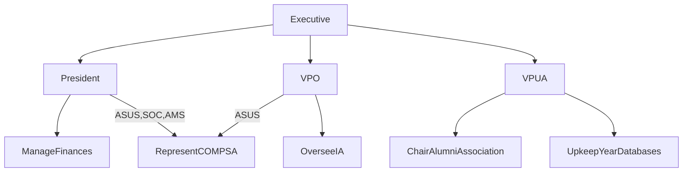

---
title: Constitution Structure
author: Queen's Computing Students' Association
colorlinks: true
...

In order to make the Constitution more accessible, I would like to try and
create a general structure that can be applied to the information in the 
text in order to make it more understandable.

# Classes

To begin, I would like to define 2 classes which will be the basis and "topics"
of the constitution. Agents, which are the personnel defined in the
constitution, and Functions, which are the duties each agent has. My hope is
that by more clearly defining these two classes, it will be easier to find the
information pertinent to the reader (normally, an Agent).

For example, we can look at the President:

